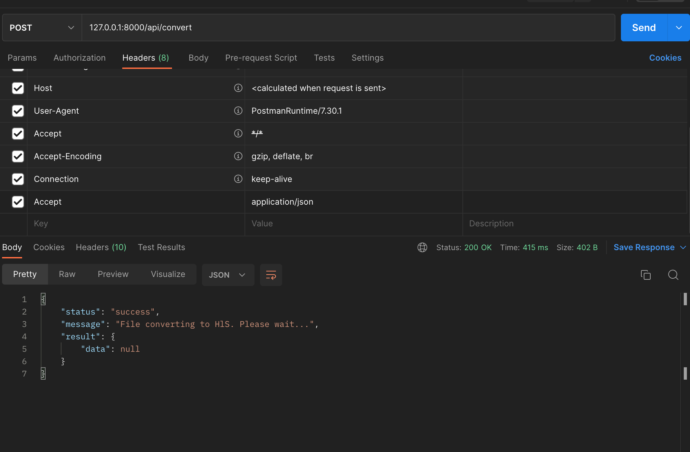

## Selar Test

An interview test for Selar based on use of ffmpeg library

## Note

- Ensure you have ffmpeg library installed on your machine

## Technology Used

PHP/Laravel, MYSQL, Tailwind CSS, and HTML

## ENV

- Set <b>QUEUE_CONNECTION=database</b>

## Guide

- Ensure your php environment is on version 7.3 since the project is based on Laravel 7
- Configure the env of the file project and link the database
- Run <b>php artisan queue:table</b>  to create the migrations for queues
- Run <b>php artisan migrate</b>
- To start your queue worker, run <b> php artisan queue:work --timeout=1200</b>

## Screenshot

